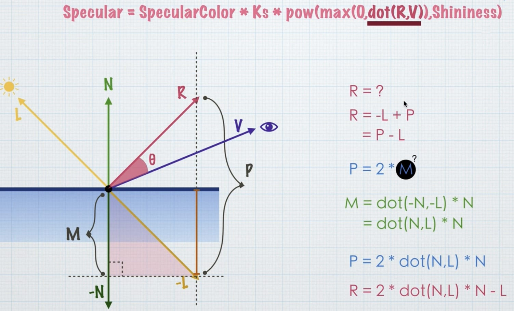

# 光

## 1. 光照模型
经验型: 
Lambert  
Phong  
Blinn-Phong  

物理型:
PBR  

### 1.1 Lambert光照模型
经验型，没有物理依据，只是看起来对，结合笔记28-Lambert.shader

```
Diffuse = Ambient + Kd * LightColor * max(0, dot(N,L))
```

+ Diffuse: 最终物体上的漫反射光强
+ Ambient: 环境光强度，为了简化计算，采用一个常数表示
+ Kd: 物体材质对光的反射系数
+ LightColor: 光源的颜色光强
+ N: 顶点的单位法线向量
+ L: 顶点指向光源的单位向量

### 1.2 Phong光照模型
Lambert漫反射，Phong处理高光，结合29-Phong.shader
Phong需要在Lambert漫反射基础上加上高光处理

```
Sepcular = SepcularColor * Ks * pow(max(0, dot(R, V)), Shininess)
```

+ Sepcular: 最终物体上的高光反射
+ SepcularColor: 高光颜色
+ Ks: 反射系数
+ R: 反射单位向量
+ V: 顶点到观察点的单位向量
+ Shininess: 高光指数，用于模拟高光范围



### 1.3 Blinn-Phong光照模型
在Phong模型基础上的优化版本，性能更好，结合29-Phong.shader
```
Sepcular = SepcularColor * Ks * pow(max(0, dot(N, H)), Shininess)
```

+ N: 反射单位向量
+ H: 入射光线L与视线V的中间向量，也称为半角向量


## 2. 渲染路径 LightMode
为进行光照计算而设计的渲染方式

(1) 前向渲染路径 Forward Rendering Path
(2) 延迟渲染路径 Deferred Rendering Path
(3) 顶点照明渲染路径(废弃) Vertex Lit Rendering Path, Legacy
(4) 旧的延迟渲染路径(废弃) Deferred Rendering Path, Legacy

### 2.1 延迟渲染路径 Deferred Rendering Path

将着色计算进行延后处理的渲染方式

几何处理 G-Buffer Pass => 光照处理 Lighting Pass

效果好、光源数量不限、支持像素级效果，但不支持半透明效果、不支持抗锯齿、内存开销大、不支持正交相机

支持条件：

(1) 显卡必须支持 Multiple Render Targets(MRT)，即多渲染目标

(2) ShaderModel 在3.0及以上

(3) 手机平台在OpenGL3.0及以上

### 2.2 在shader中如何区分渲染路径

`Tags{"LigthMode"="Always"}`

+ `Always`: 默认设置，任何情况下都会渲染，没有灯光信息
+ `ForwardBase`: 前向渲染中的基础Pass
+ `ForwardAdd`: 前向渲染中的额外Pass
+ `Deferred`: 延迟渲染

## 3. 前向渲染路径 Forward Rendering Path
渲染方式:
1. ForwardBase (逐像素、逐顶点、SH球谐)
2. ForwardAdd (逐像素)

如果一个灯被标记为 Not Important，则采用逐顶点或SH
最亮的一盏平行灯采用逐像素
被标记为 Important 的灯采用逐像素
如果上面产生逐像素的灯数量小于工程中的像素灯数量，则会有更多的灯采用逐像素

ForwardBase仅用于一个逐像素的平行灯，以及所有的逐顶点与SH
ForwardAdd用于其他所有的逐像素灯


## 4. 灯光类型

Directional 平行灯

Point 点灯

Spot 聚光灯

Area 面光灯，仅用于烘焙


