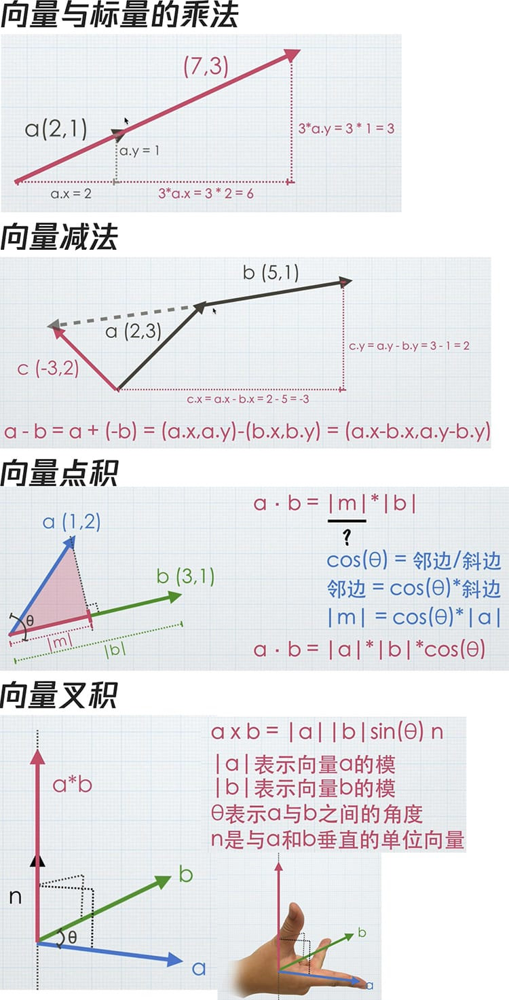

## 1. 向量的加法

几何解释：向量a和向量b首尾相连

```
a + b = (a.x, a.y) + (b.x, b.y) = (a.x + b.x, a.y + b.y)
```

## 2. 向量的减法

几何解释：a + (-b)
```
a - b = a + (-b) = (a.x, a.y) - (b.x, b.y) = (a.x - b.x, a.y - b.y)
```

## 3. 向量的模
几何解释：向量的长度
```
a = (x, y)
|a| = 2√(x^2 + y^2)
b = (x, y, z)
|b| = 2√(x^2 + y^2 + z^2)
```

## 4. 向量与标量的乘法
几何解释：向量放大n倍
```
a * k = (a.x, a.y) * k = (a.x * k, a.y * k)
```

## 5. 向量的点积

`a · b = |a|*|b|*cos(θ)`

几何解释：a向量在b向量上的投影(垂直于b向量)
```
a = (1,2)
a = (3,1)
a · b = (a.x, a.y) · (b.x, b.y) = a.x * b.x + a.y * b.y = 1 * 3 + 2 * 1 = 5
```

## 6. 向量的叉积

`a x b = |a||b|sin(θ)n`

```
|a|表示向量a的模
|b|表示向量b的模
θ表示a与b之间的角度
n是与a和b垂直的单位向量
```

几何解释：同时垂直于向量a和向量b的另一条向量，用右手法则判定方向

叉积不满足交换律

