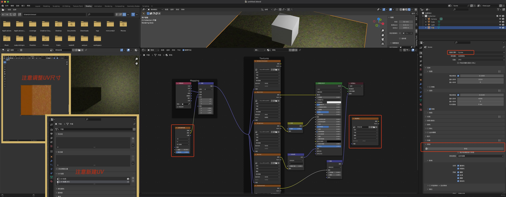

# blender笔记

## 0. 工程准备

项目配置与插件勾选


## 1. 视图切换操作

`1`: 主视图，+ `ctrl` 为后视图

`7`: 俯视图，+ `ctrl` 为底视图

`3`: 右视图，+ `ctrl` 为左视图

`0`: 摄像机视图

`ctrl`+`option`+`q` 四视图

`滚轮`: 滚动视角

`cmd` + `滚轮`: 缩放

`shift` + `滚轮`: 平移

`/` : [重要]隔离模式，进入/退出局部视图，单独编辑某个物体

`.` : [重要]快速聚焦物体，实用

`~` : 切换视图

`shift` + `右键` : 游标移动，移动到面上，方便添加物体

`cmd` + `g` : 重置物体位置，坐标归零

`H` / `option` + `H` : 隐藏/取消隐藏物体

切换摄像机视角: 切换摄像机模式后勾选锁定摄像机到视图方位

`M` : 图层分组，新建分组后，选中物体 `M` 移动到指定分组

> c4d用户可以在设置中勾选模拟3键鼠标，使用 `alt` + 鼠标实现旋转视角

## 2. 游标和原点

`shift` + `S`

游标移动：`shift` + `右键`，移动到面上，方便添加物体

游标吸附：网格 => 吸附 => 游标->选中项

移动原点：右上角 选项=>仅影响原点，修改原点位置后取消勾选

设置原点：物体模式 => 菜单物体 => 设置原点=>几何中心 或 物体模式右键=>设定原点=>几何中心

ss

## 3. 物体操作

安装插件添加额外物体: 菜单编辑=>偏好设置=>插件搜索  extra object

### 3.1 添加删除

`shift` + `A`: 添加物体

`shift` + `D`: 独立复制物体

`option` + `D`: 关联复制

`X` / `delete`: 删除物体

`F`: [重要]根据顶点补充面，也可从 菜单顶点=>从顶点创建边/面


### 3.2 移动、旋转、缩放

`G` + `X/Y/Z`: 移动，按两下坐标切换局部坐标系！

`R` + `X/Y/Z`: 旋转

`S` + `X/Y/Z`: 缩放

`alt` + `s`: 法向缩放，不调整视角，让点沿着法向移动。编辑模式下选中点，鼠标移动

`RR` : 自由旋转，注意选中多个物体时，选上方调整轴心点，选各自原点

`GG` : 沿线移动，如移动环切线，先 `option` + `click` 选中一圈环切线，然后移动

[重要]：将线、面打直、打平可以通过 `S` + `X/Y/Z` + `0` 实现！然后应用缩放


### 3.3 合并/分离/断开/填充/桥接、父子关系

`M` : 合并，点线面，如按距离合并点

`P` : 分离，如分离非连接的物体：菜单网格=>分离=>按选中项

`V`：断开，如点脱离面

`F`：填充封闭，选中线后按F生成面，也可以选择线后，菜单面=>栅格填充

`cmd` + `J` : 合并，合并多物体为一个

`cmd` + `E`：桥接循环边，需要先选中两组循环边

`cmd` + `P` / `option` + `P` : 设置/清除父子集关系绑定，选中子元素，最后选父元素，或右键=>父级=>物体，父子集物体由虚线连接，父级修改影响子集，子集修改不影响父级，如增加父级制作统一的位移动画（也可以按住`shift` 拖动图层操作绑定/清除）

融并面: 选择多个面=>右键=>融并面

移动重叠点避免出错：编辑模式下，`A`全选，`M` 按距离合并


### 3.4 选择

`A`: 全选

`L`: 选择与当前选中目标相连的物体

`W`: 切换框选、刷选、点选

`C` + `滚轮`: 改变刷选区域大小

最端路径：编辑模式下按住 `ctrl` 选择开始结束点 或 选择菜单=>选择相连元素=>最短路径

循环选择：编辑模式下 (1) `option` + 点击线  (2) 选择菜单=>循环选择

关联选择：编辑模式下 (1) `cmd` + `L`  (2) 选择菜单=>选择相连元素=>关联项


## 4. 工作区常用操作

`ctrl` + `A` [重要]应用物体变换，如缩放增量，将缩放归1，避免修改器效果异常(物体模式下尽量保持缩放为1)

`ctrl` + `L` [重要]各类关联，如材质关联、修改器关联、动画数据关联，多选物体，最后选含目标属性的物体，选择关联

`tab`: 切换物体模式/编辑模式

`1`/`2`/`3`: 编辑模式下点线面切换

**衰减编辑**：点击上方圆圈开启关闭，在编辑时可以影响附近的点，使用鼠标滚轮调整范围大小

**吸附**：点击上方磁铁开启关闭，注意选择吸附方式

**随机选择**：编辑模式下菜单选择 => 随机选择，结合衰减+法向缩放

`N` 打开/关闭右侧属性面板

`F12` 渲染

`F9` 上一步操作，如添加立方体还没设置参数

资产管理: 在大纲中图层右键保存为资产，编辑器下方打开资产管理器


## 5. 工具栏(工作区左侧)

`cmd` + `B`: 倒角，编辑模式选择边，滚动或`S`控制分段数量，倒角修改器不生效？关闭倒角里的钳制重叠选项，https://zhuanlan.zhihu.com/p/584284785，或尝试 `M` 按距离合并

`cmd` + `R`: 环切

`E`: 挤出

`option` + `E`: 挤出选项

`shift` + `space`: 快速打开工具栏

`I`: 内插面，+ `O` 外插

`K`: 切割，+ `A` 角度限制，+ `C` 穿透切割，空格完成切割

多边形建形: 相当于点移动或多边形的挤出，注意打开右上角的 `自动合并顶点`，可以配合打开自动吸附，小技巧：选择四边面的边时会挤出三角面，选择三角面的边时会补为四边面，`shift` 反向操作删除

旋绕：`option` + `E`，围绕游标旋绕边线

光滑和随机: 平滑顶点，随机可用于制作路面等

滑移边线/顶点：`g`+`g`边线滑移，`shift`+`v`多顶点滑移

法向缩放: 沿着法线方向缩放

推拉: 缩放实现靠近/远离游标

切变: 按某个轴实现形变

球形化: 让物体趋近球体

断离区域: 打开效果，如立方体纸箱开一个角，再如开罐头效果


## 6. 修改器(右侧扳手面板)

表面细分修改器：性能更好

实体化修改器：平面增加高度(厚度)，效果类似挤出，比如结合文本

倒角修改器：和倒角功能效果相同，但不破坏元数据

阵列修改器：快速生成多物体，如树叶

布尔修改器：吸管吸物体，做布尔运算，记得关闭运算物体的显示

镜像修改器：实现对称，推荐尝试勾选范围限制

缩裹修改器：例如将平面贴合到物体上(如苔藓)，选择目标对象

蒙皮修改器：修改半径 `CMD` + `A`，勾选蒙皮修改器的平滑着色可以让模型平滑着色

置换修改器：根据纹理图片的黑白信息进行形变

简易形变修改器：形变，如树叶弯曲等

曲线修改器：绑定路径曲线实现形变，注意曲线方向，`option` + `S` 修改半径

晶格修改器：用于控制区域形变，如制作松叶，`shift` + `A` 创建晶格，包住目标对象，`cmd` + `P` 绑定晶格形变，设置晶格细分，进入编辑模式后可以调节晶格形变，影响目标对象形变


## 7. 布尔运算（布尔修改器）

偏好设置中添加 bool tool 内置插件

添加布尔修改器，N面板中调出布尔参数


## 6. 摄像机与灯光

**设置相机跟随**：创建新摄相机，物体模式=>摄像机=>设置活动物体为相机，选中相机，`shift` 选中物体，`cmd` + `P` => 物体，设置父子集

点光源可以设置半径来调节硬度


## 9. 文本

进入编辑模式修改文本，中文只能粘贴进去，注意选择中文字体

注意使用 **实体化修改器**


## 10. 曲线


多段线：可以通过添加平面=>转换曲线实现

贝塞尔曲线：添加后可以使用 `SY0` 打直，`A` 全选右键添加细分，调节

NURBS曲线：不适合创建复杂的曲线


连续画线：挤出并移动E，移动(G)顶点，使用挤出(E)修改形状，

网格转换曲线：物体模式 => 菜单物体 => 转换 => 曲线

转换线类型：编辑模式右键=>改变样条类型

转换贝塞尔曲线点类型：贝兹点 <=> 贝兹拐角点，`V` 或右键 => 设置控制柄类型

细分插入点：选中已有两点，右键细分


闭合：`F`

分离：`P`

断开：`X` 删除-段数


线倒角，可以用来做管子，可以设置切口形状(曲线而非网格)

缩放曲线倒角半径：`option` + `S`


设置父子级关系时选择 顶点(基于三点) 可以使物体跟随曲线曲率变动

## 11. 动画

底部切换为动画时间线面板 / 曲线编辑器

`I`: 插入关键帧（需要在右侧面板上的属性上操作，如位置旋转缩放）

沿路径效果：物体模式绘制曲线，菜单物体=>转换=>网格

`shift` + `D` 复制开始关键帧放到动画最后，实现动画回复

`ctrl` + `L`  关联动画数据，若要独立动画，菜单物体=>关系=>使其独立化

**短帧动画循环**：调节插值模式，动作编辑器=>菜单通道=>外插模式=>使用循环


## 12. 动画输出优化

使用GPU渲染

在右侧输出部分调小输出采样如 256～1024，噪波阈值如 0.1～0.2，菜单输出动画


## 13. 骨骼

### 13.1 姿态模式

姿态模式：用于做动画切换姿态，旋转移动骨架，查看骨架父子关系是否正确

清空变换：`A` 全选，右键清空姿态变换


### 13.2 骨骼创建

添加骨架：`shift` + `A` ，右侧选项=>视图显示=>**在前面**

挤出骨骼： `E` 挤出创建骨骼，注意：小头挤出创建关联骨骼，大头挤出创建**没有关联的骨骼**

骨架复制：编辑模式菜单骨架=>对称，注意选中的骨骼命名规范，推荐如：`大腿_L`，复制后为：`大腿_R`


### 13.3 关系绑定

手动创建绑定父子关系：`ctrl`/`cmd` + `P`，保持偏移量，如耳朵绑定到头上随头动，而不是绑身体上

清除父子关系：`option` + `P`

骨骼连接：`ctrl` + `P`，相连项


### 13.4 骨骼约束

骨骼约束如下图，需要设置一个控制骨和一个极骨。

(1) 为小腿添加控制骨骼（可以理解为骨骼形状的空物体，注意 `option` + `P` 清空父级）

(2) 小腿骨骼添加骨骼约束—>反向动力学，目标参数为当前骨架，骨骼参数为添加的控制骨

(3) 大头挤出没有关联的骨骼作为极骨，限制运动幅度

注意：极骨方向，编辑模式下右键切换方向，小头朝内，如下图所示

注意：腿骨绑定身体骨后，修改骨骼约束的链长，如此处参数为2(否则影响身体部分骨骼)

注意：编辑模式中，骨骼接头要有一定角度，blender才知道往前还是往后弯曲

**重算扭转处理轴向错误**：统一骨骼轴向，用于修正一些轴向错误，全选骨架，最后选中目标骨骼，菜单骨架=>骨骼扭转=>重算扭转=>活动骨骼，或使用快捷键 `shift` + `N`，若还是不对，直接进姿态模式，调整右侧极相角度


### 13.5 骨骼绑定

物体模式先选中物体(如环切后的圆柱体)再选中骨骼，进入姿态模式，`cmd` + `P` =>骨架形变(附带自动权重) 或选择 骨骼(机器人)

在大纲中选中物体，在编辑模式下可以修改权重值，也可以在权重模式中通过笔刷修改颜色映射不同权重值


### 13.6 骨骼动画

底部面板选择 => 动画摄影表 => 动作编辑器

新建动画，如下图所示，如"走路"

姿态模式调节骨骼位置，`A` 全选骨骼，`I` 插入关键帧记录位置和旋转

关键帧复制、粘贴翻转：`cmd` + `C` ，菜单关键帧=>粘贴翻转   `cmd` + `shift` + `V` 

非骨骼动画在物体模式下制作


## 14. 着色、原理化BSDF着色器、PBR(基于物理渲染材质)

右键 => 平滑/平直着色: 不增加顶点实现表面平滑效果，物体右键选择平滑着色/平直着色，在右侧物体面板=>法向=>自动光滑，小于设置角度时平滑着色不生效

原理化BSDF类似PBR，基于物理渲染，兼容性较好

https://docs.blender.org/manual/zh-hans/latest/render/shader_nodes/shader/principled.html


```
PBR全称是Physicallly-BasedRendering，所以PBR材质就是指基于物理渲染的材质，它是通过 模拟物体真实的物理特性从而来模拟物体的真实材质效果
pbr材质有两套设置方法：
1、Metallic/Roughness金属度/粗糙度流程，它是通过设置基础色(Basecolor)、金属度(Metal-lic)、粗糙度(Roughness)、法线(Normal)、置换(displacement)、环境光遮蔽(Ambient Occlusion）来模拟真实材质效果。
2、Specular/Glossiness高光/光泽度流程，它是通过设置基础色(Diffuse）、高光(specular)、光泽度(Glossiness)、法线(Normal)、置換(displacement)、环境光遮蔽(AmbientOcclusion) 来模拟真实材质效果。
```

法线贴图是假凹凸，通过光影效果实现，置换贴图是真凹凸，需要模型有足够的细分

环境光遮蔽贴图用于Eevee渲染器，Cycles渲染器根据光计算渲染，不需要这种贴图

纹理下载：

https://polyhaven.com/

https://www.poliigon.com/

贴图处理软件，用于将拍的照片处理各种贴图：

https://boundingboxsoftware.com/materialize/downloads.php


**贴图一键导入**

为了方便blender一键导入，需要文件名包含一些关键词：`_diffuse` (基础色)、`_displacement`、`_normal`、`_roughness`、`_ao` 等

操作方式：在 shading 模式中选中原理化 BSDF 节点，确认开启 `node wrangler` 插件，`ctrl` + `shift` + `T` 导入贴图

调整贴图平铺次数：


置换贴图注意：贴图面板中要选置换与凹凸，且要有足够的细分

node节点分组：`cmd` + `J`

线打结：`shift` + `右键`


沃罗诺伊纹理种出随机草地：shading 中 `shift` + `A` => 纹理 => 沃罗诺伊纹理，输出颜色连接BSDF基础色查看随机效果，将输出颜色连接到mapping位置实现随机草地，见下图烘焙


## 15. 烘焙 TODO

烘焙：把光照阴影提前计算好，输出到纹理贴图，性能更好，效果更逼真




## 16. UV

载入UV图：UV Editing模式新建图像=>生成类型=>彩色栅格图

展UV：编辑模式 => uv菜单 => 清除缝合边 => 线模式选中边线 => 标记缝合边 => uv菜单 => 展开

UV调整，注意在BSDF材质中基础色选择图像纹理


从视角投影：uv模式下选择面=>切换(正)视图=>菜单UV=>从视角投影


## 17. 刚体与刚体约束

右侧面板为物体添加刚体属性

刚体约束：如摄像机跟随子弹效果可以在右侧刚体约束面板中添加 **复制位置**，设置偏移量


## 18. 粒子系统

右侧面板中添加粒子系统，设置一个发射面，调节参数，如毛发可以制作草坪、路边小树(选择目标物体)


## 19. 模型优化

相同的物体元素，不要使用 `shift` + `D` 复制，需要使用 `option` + `D` 复制，共用材质等属性

处理网络下载的模型：

(1) 降低顶点数量，编辑模式=>菜单网格=>清理=>按间距合并

(2) 着色器必须改为原理化BSDF才能导出在threejs中正常使用的gltf模型，修改着色器类型后注意还原原来的基础色和自发光等属性，透明度改为投射属性等等

(3) 删除没有作用的着色器

decimate 修改器？


## 20. gltf 模型导出优化

(1) 输出预设=>几何=>图像=>jpg格式

(2) 尽量选glb格式，并勾选压缩

(3) 服务器使用gzip压缩


## 21. 优化three渲染

原理化 BSDF 默认没有灯光，需要在 scene 中添加 hdr 场景和环境

调整摄像机位置

调整 renderer.toneMappingExposure 渲染器曝光度

添加平行光

设置渲染器 logarithmicDepthBuffer 对数深度缓冲属性，避免草地、平面距离太近导致的闪烁


## 22. 其他

threejs中尝试空物体与DOM结合

形变动画：如做出开花效果，先导出多个顶点个数相同的glb模型(后续变形模型仅需顶点数据)，再使用three的形变动画，设置原物体的变形顶点数据 morphAttributes，然后调用 updateMorphTargets 更新，最后使用gsap动画设置影响程度参数(morphTargetInfluences)从0到1


万向坐标系，YXZ欧拉